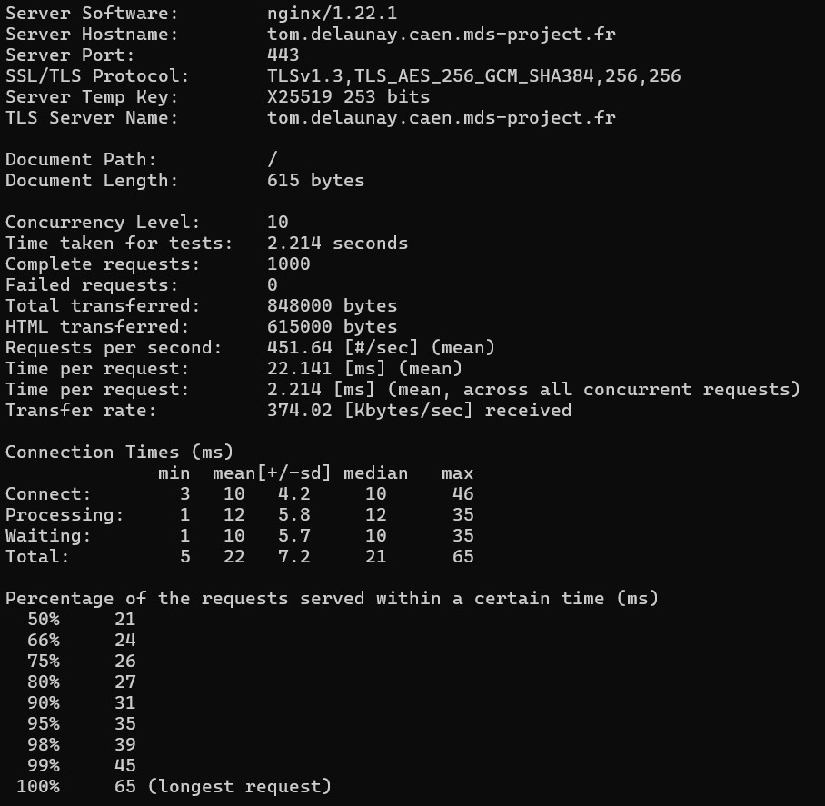

# Étape 0 – Outils de base

## htop
- **Installation :** `sudo apt install htop`
- **Rôle :** Affiche les processus système de manière interactive, avec l'utilisation CPU/RAM.
- **Commande utile :** `htop`

## curl
- **Installation :** `sudo apt install curl`
- **Rôle :** Outil en ligne de commande pour transférer des données via HTTP(S), FTP, etc.
- **Commande utile :** `curl https://example.com`

## wget
- **Installation :** `sudo apt install wget`
- **Rôle :** Permet de télécharger des fichiers depuis un serveur HTTP ou FTP.
- **Commande utile :** `wget https://example.com/fichier.zip`

## zsh
- **Installation :** `sudo apt install zsh`
- **Rôle :** Shell plus moderne et personnalisable que bash.
- **Commande utile :** `zsh`

## oh-my-zsh
- **Installation :** `sh -c "$(curl -fsSL https://raw.githubusercontent.com/ohmyzsh/ohmyzsh/master/tools/install.sh)"`
- **Rôle :** Framework pour personnaliser zsh avec des thèmes, plugins, alias...
- **Commande utile :** `source ~/.zshrc`

## git
- **Installation :** `sudo apt install git`
- **Rôle :** Système de versionnement de code (GitHub, GitLab...).
- **Commande utile :** `git clone https://github.com/...`

## nano
- **Installation :** `sudo apt install nano`
- **Rôle :** Éditeur de texte en ligne de commande simple.
- **Commande utile :** `nano fichier.txt`

## vim
- **Installation :** `sudo apt install vim`
- **Rôle :** Éditeur de texte puissant pour le terminal.
- **Commande utile :** `vim fichier.txt`

## tree
- **Installation :** `sudo apt install tree`
- **Rôle :** Affiche l’arborescence d’un répertoire sous forme d’arbre.
- **Commande utile :** `tree`

## lsof
- **Installation :** `sudo apt install lsof`
- **Rôle :** Liste les fichiers ouverts par les processus.
- **Commande utile :** `lsof -i`

## ncdu
- **Installation :** `sudo apt install ncdu`
- **Rôle :** Analyse l’espace disque utilisé par répertoire, interactif.
- **Commande utile :** `ncdu /`

## ufw
- **Installation :** `sudo apt install ufw`
- **Rôle :** Pare-feu simple pour gérer les règles réseau.
- **Commande utile :** `sudo ufw status`

## fail2ban
- **Installation :** `sudo apt install fail2ban`
- **Rôle :** Surveille les tentatives d’intrusion et bloque les IP malveillantes.
- **Commande utile :** `sudo fail2ban-client status`

## openssh-server
- **Installation :** `sudo apt install openssh-server`
- **Rôle :** Permet la connexion SSH à ton serveur.
- **Commande utile :** `sudo systemctl status ssh`

## sudo
- **Installation :** `sudo apt install sudo`
- **Rôle :** Permet à un utilisateur d’exécuter des commandes avec les privilèges root.
- **Commande utile :** `sudo apt update`

## cron
- **Installation :** `sudo apt install cron`
- **Rôle :** Planifie l’exécution automatique de tâches.
- **Commande utile :** `crontab -e`

## rsync
- **Installation :** `sudo apt install rsync`
- **Rôle :** Synchronisation rapide de fichiers/localisations.
- **Commande utile :** `rsync -avz /source /destination`

## net-tools
- **Installation :** `sudo apt install net-tools`
- **Rôle :** Fournit des commandes réseau classiques comme `ifconfig`, `netstat`.
- **Commande utile :** `ifconfig`

## iproute2
- **Installation :** `sudo apt install iproute2`
- **Rôle :** Fournit des outils modernes pour gérer les interfaces et le routage.
- **Commande utile :** `ip a`

## screen
- **Installation :** `sudo apt install screen`
- **Rôle :** Permet d'exécuter des sessions persistantes en terminal.
- **Commande utile :** `screen -S ma_session`

## lsb-release
- **Installation :** `sudo apt install lsb-release`
- **Rôle :** Fournit des infos sur la distribution Linux utilisée.
- **Commande utile :** `lsb_release -a`

# Étape 1 – Déploiement initial

## Mise à jour du système

Commande :
```
sudo apt update && sudo apt upgrade -y
```

## Création d’un utilisateur admin avec sudo

Commandes :
```
sudo adduser adminsys
sudo usermod -aG sudo adminsys
```

L’utilisateur `adminsys` peut désormais exécuter des commandes avec `sudo`.

## Authentification SSH par clé uniquement

### Génération de la clé (sur le poste local)

Commande :
```
ssh-keygen -t rsa -b 4096
```
La clé publique est enregistrée dans `~/.ssh/id_rsa.pub`.

### Copie de la clé publique sur le VPS

#### Méthode automatique :
```
ssh-copy-id adminsys@ip_du_vps
```

#### Méthode manuelle (si ssh-copy-id indisponible) :

1. Copier le contenu de `~/.ssh/id_rsa.pub`
2. Se connecter au VPS :
```
ssh adminsys@ip_du_vps
mkdir -p ~/.ssh
nano ~/.ssh/authorized_keys
```
3. Coller la clé publique, enregistrer avec `CTRL+O`, puis quitter `CTRL+X`
4. Régler les permissions :
```
chmod 700 ~/.ssh
chmod 600 ~/.ssh/authorized_keys
```

## Désactiver la connexion root et le mot de passe SSH

Modifier le fichier de config SSH :
```
sudo nano /etc/ssh/sshd_config
```

Changer ou décommenter ces lignes :
```
PermitRootLogin no
PasswordAuthentication no
```

Redémarrer le service :
```
sudo systemctl restart ssh
```

## Vérification

Test de connexion :
```
ssh adminsys@ip_du_vps
```

✅ La connexion se fait sans mot de passe (via clé SSH)  
❌ La connexion root est désactivée

# Étape 2 – Sécurisation

## Configuration du pare-feu UFW

### Autorisation des ports nécessaires :
```
sudo ufw allow OpenSSH
sudo ufw allow 80/tcp
sudo ufw allow 443/tcp
```

### Activation du pare-feu :
```
sudo ufw enable
```

### Vérification de l’état :
```
sudo ufw status verbose
```

## Installation et configuration de Fail2Ban

### Installation :
```
sudo apt install fail2ban -y
```

### Création du fichier de configuration :
```
sudo nano /etc/fail2ban/jail.local
```

### Contenu du fichier `jail.local` :
```
[DEFAULT]
bantime = 3600
findtime = 600
maxretry = 5

[sshd]
enabled = true
port = ssh
logpath = /var/log/auth.log
backend = systemd
```

### Redémarrage et activation :
```
sudo systemctl restart fail2ban
sudo systemctl enable fail2ban
```

### Vérification du service :
```
sudo systemctl status fail2ban
```

### Statut du jail SSH :
```
sudo fail2ban-client status sshd
```

## Vérification des ports ouverts

Utilisation de nmap pour vérifier les ports accessibles :
```
sudo apt install nmap
nmap localhost
```

Les seuls ports ouverts doivent être : **22 (SSH)**, **80 (HTTP)** et **443 (HTTPS)**

# Étape 3 – Monitoring avec Netdata (port personnalisé 12001)

## Installation de Netdata

Commande utilisée :
```
bash <(curl -Ss https://get.netdata.cloud/kickstart.sh)
```

Ce script installe Netdata et configure le service automatiquement.

## Configuration de Netdata pour écoute sur le port 12001

Fichier de configuration modifié :
```
sudo nano /etc/netdata/netdata.conf
```

Contenu ajouté :
```
[web]
    bind to = 0.0.0.0
    default port = 12001
```

Redémarrage de Netdata :
```
sudo systemctl restart netdata
```

## Ouverture du port dans le pare-feu

Commande utilisée :
```
sudo ufw allow 12001/tcp
```

## Vérification du service

Test local :
```
curl http://localhost:12001
```

Accès via navigateur :
```
http://31.207.38.218:12001
```

## Fonctionnalités observées

Netdata permet de visualiser en temps réel :
- Utilisation CPU
- Charge mémoire
- Activité réseau
- Utilisation des disques
- Processus actifs

## (Bonus) – Alerte espace disque > 80%

Fichier de configuration :
```
sudo nano /etc/netdata/health.d/disk_space.conf
```

Exemple de configuration :
```
template: disk_space
      on: disk_space._.avail
    calc: 100 - $this * 100 / $total
     every: 10s
     warn: $this > 80
     info: used space is over 80%
      to: sysadmin
```

Redémarrage :
```
sudo systemctl restart netdata
```

# Étape 4 – Serveur Web & Reverse Proxy avec Nginx, Docker & HTTPS

## Installation de Nginx

Commande utilisée :
```
sudo apt install nginx -y
```

Vérification :
```
sudo systemctl status nginx
curl http://localhost
```

---

## Installation de Docker

Commandes utilisées :
```
sudo apt install docker.io -y
sudo systemctl enable docker
sudo systemctl start docker
sudo usermod -aG docker $USER
```

---

## Lancement d’un conteneur Nginx

```
docker run -d --name mon-nginx -p 8080:80 nginx
```

Test :
```
curl http://localhost:8080
```

---

## Configuration du reverse proxy Nginx

Création du fichier de config :
```
sudo nano /etc/nginx/sites-available/mon-projet
```

Contenu :
```
server {
    listen 80;
    server_name tom.delaunay.caen.mds-project.fr;

    location / {
        proxy_pass http://localhost:8080;
        proxy_set_header Host $host;
        proxy_set_header X-Real-IP $remote_addr;
        proxy_set_header X-Forwarded-For $proxy_add_x_forwarded_for;
    }
}
```

Activation :
```
sudo ln -s /etc/nginx/sites-available/mon-projet /etc/nginx/sites-enabled/
sudo nginx -t
sudo systemctl reload nginx
```

Accès test :
```
http://tom.delaunay.caen.mds-project.fr
```

---

## Obtention du certificat HTTPS avec Certbot (Let’s Encrypt)

Installation de Certbot :
```
sudo apt install certbot python3-certbot-nginx -y
```

Génération du certificat :
```
sudo certbot --nginx -d tom.delaunay.caen.mds-project.fr
```

Certbot configure automatiquement :
- Redirection HTTP → HTTPS
- Certificat SSL valide

---

Accès final sécurisé :
```
https://tom.delaunay.caen.mds-project.fr
```

# Étape 5 – Test de charge

## Outil utilisé : Apache Benchmark (`ab`)

Installation :
```
sudo apt install apache2-utils -y
```

---

## Commande exécutée :
```
ab -n 1000 -c 10 https://tom.delaunay.caen.mds-project.fr/
```

- `-n 1000` : nombre total de requêtes
- `-c 10` : nombre de connexions simultanées

---

## Résultats du test



# Étape 6 – Maintenance & Sauvegarde automatique

## Objectif

Mettre en place un script de sauvegarde automatique compressée des dossiers :
- `/etc`
- `/var/log`
- `/home/adminsys`

Les sauvegardes sont stockées dans `/home/adminsys/backup` et planifiées toutes les 6 heures via cron.

---

## 1. Création du dossier de sauvegarde

```
mkdir -p /home/adminsys/backup
```

---

## 2. Script de sauvegarde : `/home/adminsys/backup.sh`

```bash
#!/bin/bash

# Variables
DATE=$(date +%Y-%m-%d_%H-%M)
BACKUP_DIR="/home/adminsys/backup"
FILENAME="backup_${DATE}.tar.gz"

# Création du dossier si inexistant
mkdir -p "$BACKUP_DIR"

# Sauvegarde avec exclusion du dossier de backup lui-même
tar --exclude="$BACKUP_DIR" -czf "$BACKUP_DIR/$FILENAME" /etc /var/log /home/adminsys

# Nettoyage : garder uniquement les 5 dernières sauvegardes
ls -1t "$BACKUP_DIR"/backup_*.tar.gz | tail -n +6 | xargs -r rm --

# Log
echo "Sauvegarde créée : $FILENAME"
```

Rendre le script exécutable :
```
chmod +x /home/adminsys/backup.sh
```

---

## 3. Exécution du script avec `sudo`

Le script nécessite des droits root pour accéder à certains fichiers système :
```
sudo /home/adminsys/backup.sh
```

(Optionnel : pour éviter le mot de passe sudo à chaque exécution, ajouter cette ligne via `sudo visudo`)

```
adminsys ALL=(ALL) NOPASSWD: /home/adminsys/backup.sh
```

---

## 4. Automatisation avec cron (toutes les 6 heures)

Ouvrir la crontab :
```
crontab -e
```

Ajouter la ligne suivante :
```
0 */6 * * * sudo /home/adminsys/backup.sh
```

---

## 5. Vérification

Les fichiers de sauvegarde compressés apparaîtront dans :
```
/home/adminsys/backup/
```

Format des fichiers :
```
backup_YYYY-MM-DD_HH-MM.tar.gz
```

---

## Résultat

- Sauvegarde automatique compressée toutes les 6 heures
- Rotation automatique des anciennes archives (5 max)
